# Introdução

Informações básicas do projeto.

- **Projeto:** GymTrack
- **Repositório GitHub:** [Link GitHub](https://github.com/ICEI-PUC-Minas-PPLES-TI/plf-es-2025-1-ti1-0387100-controle-de-treino-de-academia)
- **Membros da equipe:**

  - [Camille Baeta](https://github.com/camillebaeta)
  - [Fabricio Lopes](https://github.com/fabriciolopss)
  - [Gabriel Amaro](https://github.com/gabrielsnamaro)
  - [Gabriel Rocha](https://github.com/Gabrielrocha812)
  - [Henrique Xavier](https://github.com/henriquexvr)
  - [Samuel Rebula](https://github.com/samuelrebula)

A documentação do projeto é estruturada da seguinte forma:

1. Introdução
2. Contexto
3. Product Discovery
4. Product Design
5. Metodologia
6. Solução
7. Referências Bibliográficas

[Documentação de Design Thinking (MIRO)](concepcao/ProcessoDesignThinking.pdf)

# Contexto

A manutenção de uma rotina regular de exercícios físicos é fundamental para a promoção da saúde e da qualidade de vida. Segundo a Organização Mundial da Saúde (OMS, 2010), a prática regular de atividades físicas pode reduzir significativamente o risco de doenças crônicas, sendo que a inatividade é considerada um dos principais fatores de risco para problemas cardiovasculares e metabólicos. No Brasil, dados do Ministério da Saúde (2011) apontam que uma parcela considerável da população não atinge os níveis mínimos recomendados de atividade física.

As academias, como ambientes estruturados para a prática de atividades físicas, desempenham um papel central nesse processo. No entanto, muitos praticantes encontram dificuldades em manter a consistência nos treinos, acompanhar seu desempenho ao longo do tempo e organizar adequadamente suas atividades. Estudos indicam que cerca de 31% dos adultos não atingem os níveis de atividade física recomendados, o que reforça a necessidade de intervenções que incentivem a regularidade dos treinos. Soma-se a isso a carência de soluções digitais acessíveis e eficazes que auxiliem no registro, planejamento e visualização do progresso de forma personalizada, contribuindo para a desmotivação e, por vezes, o abandono da prática. Soma-se a isso a carência de soluções digitais acessíveis e eficazes que auxiliem no registro, planejamento e visualização do progresso de forma personalizada.

Diante desse cenário, este projeto propõe o desenvolvimento de uma aplicação web voltada ao gerenciamento de treinos em academias, com foco na experiência do usuário e no suporte à sua evolução. A aplicação oferece funcionalidades que permitem ao aluno registrar suas atividades diárias, acompanhar métricas de desempenho, gerar relatórios e gráficos, receber lembretes e sugestões automáticas, além de personalizar planos de treino de acordo com seu nível (iniciante, intermediário ou avançado) e histórico de participação.

A iniciativa também leva em consideração as restrições técnicas impostas pelo escopo acadêmico: a aplicação será implementada exclusivamente com HTML, CSS e JavaScript puro. Não será utilizado backend ou banco de dados, sendo o armazenamento realizado localmente através do localStorage, em estrutura JSON.

Essa abordagem visa consolidar conhecimentos fundamentais de desenvolvimento web, usabilidade, design responsivo, armazenamento local e boas práticas de segurança e desempenho. O público-alvo do sistema são alunos de academias que desejam uma ferramenta prática, responsiva e intuitiva para acompanhar e gerenciar sua rotina de treinos, com foco principal em acessos via dispositivos móveis, considerando o comportamento predominante dos usuários.

## Problema

A adesão e a manutenção de uma rotina consistente de treinos físicos é um desafio enfrentado por grande parte dos frequentadores de academias. Muitos alunos têm dificuldades em organizar seus treinos, acompanhar sua evolução ao longo do tempo e manter a motivação necessária para atingir seus objetivos. Em especial, a ausência de ferramentas simples e acessíveis para registrar informações e monitorar o progresso acaba dificultando a visualização dos resultados, o que pode levar à desmotivação e até ao abandono da prática.

Esse problema se agrava pelo fato de que nem todos os alunos possuem acompanhamento individualizado de profissionais, tornando ainda mais importante o uso de soluções que apoiem a autogestão da rotina de treinos. O contexto de uso da aplicação está centrado no ambiente de academias, sendo voltada principalmente a alunos que desejam ter maior controle sobre seus treinos de forma independente.

## Objetivos

O objetivo geral deste projeto é desenvolver uma aplicação web que auxilie alunos de academias a organizarem, registrarem e acompanharem sua rotina de treinos de forma prática e personalizada, contribuindo para a manutenção da regularidade e o acompanhamento da evolução física ao longo do tempo.

Objetivos específicos

- Implementar funcionalidades que permitam o registro diário de treinos, com dados como tipo de exercício, carga, repetições e observações adicionais.
- Criar mecanismos de visualização da evolução do usuário, como gráficos e relatórios simples, com base nas informações registradas.
- Desenvolver uma interface responsiva e intuitiva, com foco na usabilidade em dispositivos móveis.
- Utilizar armazenamento local via localStorage para salvar os dados do usuário, respeitando as restrições técnicas do projeto.
- Explorar recursos interativos, como lembretes de treino e feedback pós-treino, para incentivar a constância e engajamento do usuário.

## Justificativa

O que impulsionou a realização deste trabalho foi compreender que a manutenção de uma rotina de treinos é um desafio comum enfrentado por alunos de academias, muitas vezes pela ausência de organização, registro de atividades e acompanhamento de resultados. A motivação central está na percepção de que, ao tornar esse processo mais acessível e visual, é possível aumentar a constância e o engajamento dos praticantes. Além disso, o desenvolvimento deste projeto representa uma oportunidade de aplicar e aprofundar conhecimentos em desenvolvimento web, usabilidade e design centrado no usuário.

## Público-Alvo

A aplicação é voltada principalmente para alunos de academias que desejam organizar e acompanhar sua rotina de treinos de forma prática e acessível. O público-alvo é composto por pessoas que praticam atividades físicas regularmente ou estão iniciando essa jornada e buscam maior controle sobre sua evolução pessoal, mesmo sem acompanhamento direto de um profissional de educação física.

Perfis de usuários:

- Praticantes iniciantes: indivíduos que estão começando na academia, com pouca experiência no planejamento de treinos. Em geral, possuem conhecimento básico de tecnologia e utilizam o celular como principal meio de acesso à internet.
- Praticantes intermediários ou avançados: usuários com rotina de treino estabelecida, que já têm familiaridade com tipos de exercícios, mas desejam melhorar o acompanhamento da evolução e otimizar sua organização. Esses usuários tendem a buscar funcionalidades mais analíticas, como gráficos e relatórios.
- Usuários de dispositivos digitais (celular ou computador): pessoas que utilizam dispositivos digitais em seu dia a dia para navegar na internet ou acessar ferramentas online, incluindo alunos com diferentes níveis de familiaridade com tecnologia. A interface da aplicação busca atender tanto usuários experientes quanto aqueles com baixa afinidade digital, oferecendo uma navegação simples, clara e intuitiva.

A aplicação foi pensada para ser utilizada prioritariamente em dispositivos móveis, considerando o comportamento de uso típico dos frequentadores de academias — que preferem acessar recursos diretamente pelo celular durante ou após o treino. Por esse motivo, a interface deve ser responsiva, com foco em usabilidade e acessibilidade.

Além disso, como não há hierarquia entre os usuários (a aplicação é voltada ao uso individual), todos os perfis têm acesso às mesmas funcionalidades, com foco na personalização da experiência de acordo com suas necessidades e níveis de prática.

# Product Discovery

## Etapa de Entendimento

- **Matriz CSD**:
  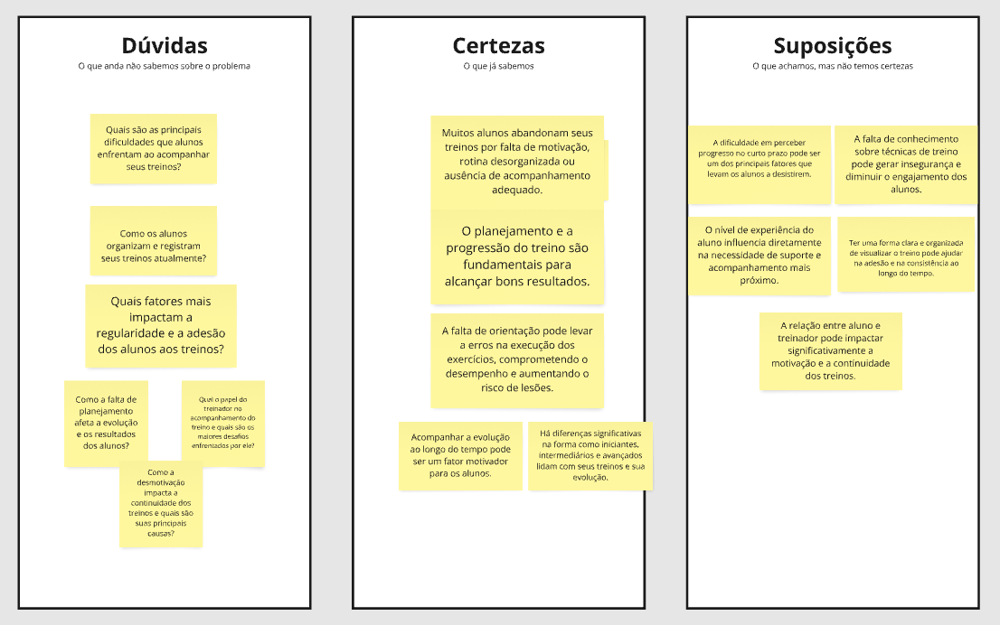
- **Mapa de stakeholders**:
  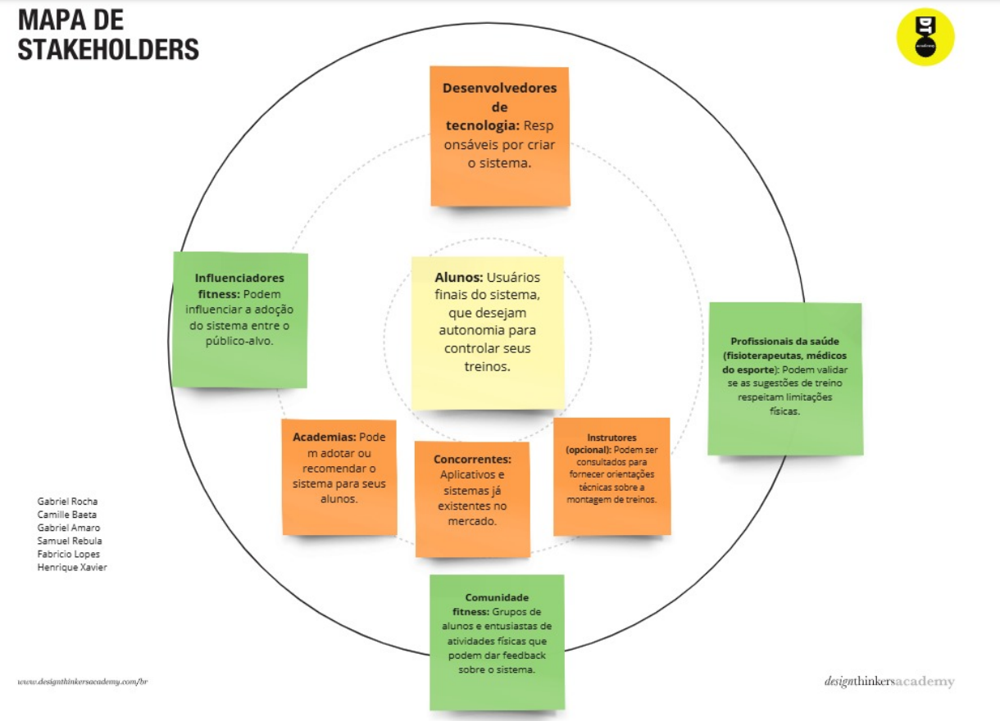
- **Entrevistas qualitativas**:
  
- **Highlights de pesquisa**:
  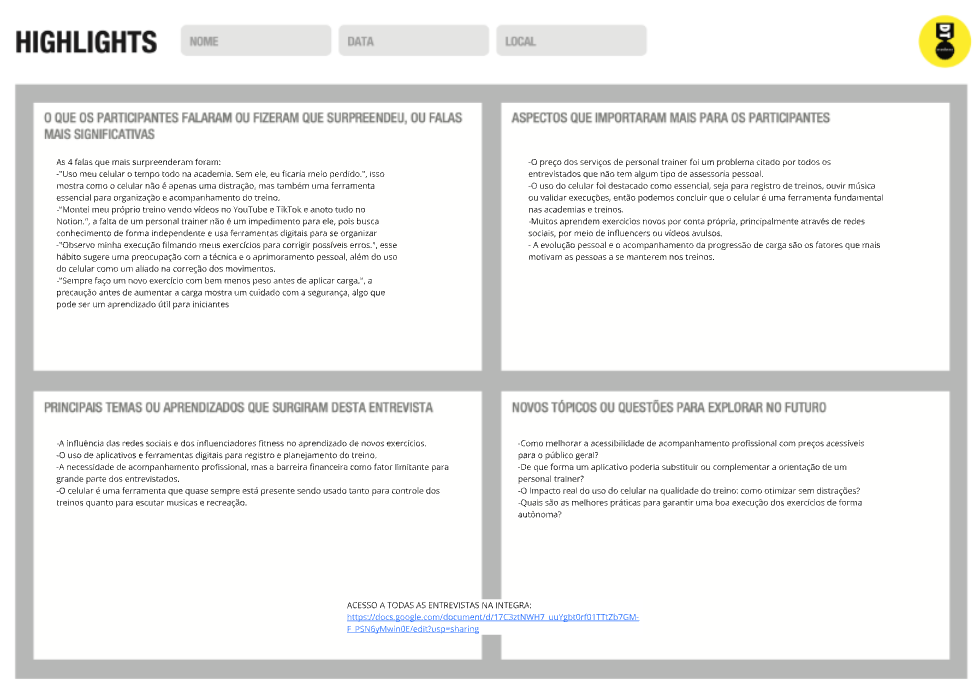

## Etapa de Definição

### Personas

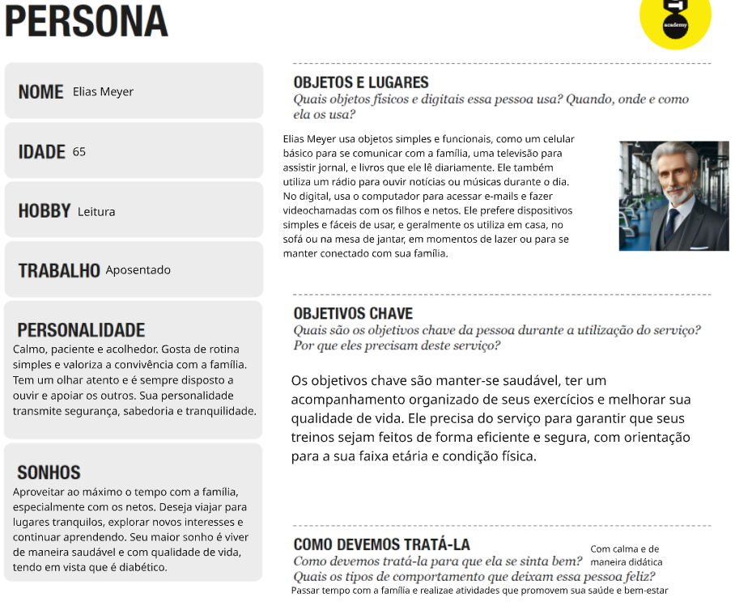
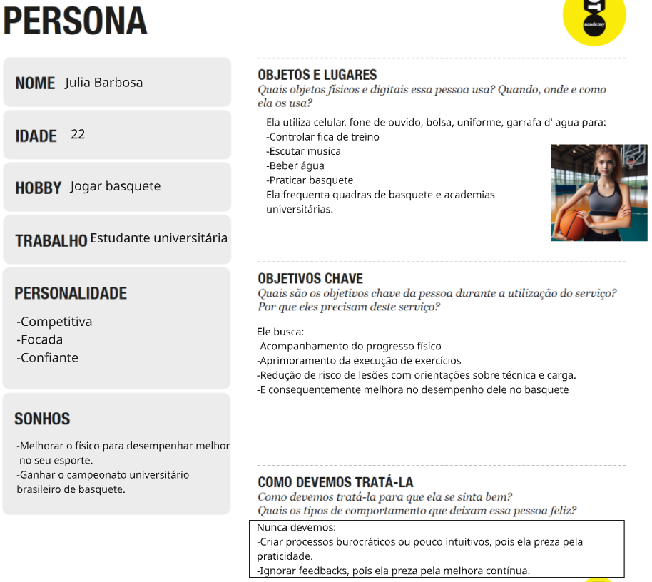
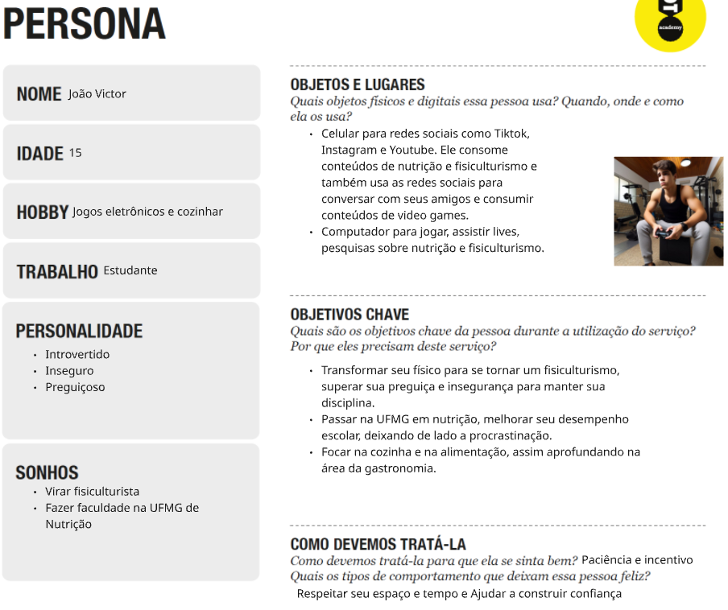

# Product Design

Nesse momento, vamos transformar os insights e validações obtidos em soluções tangíveis e utilizáveis. Essa fase envolve a definição de uma proposta de valor, detalhando a prioridade de cada ideia e a consequente criação de wireframes, mockups e protótipos de alta fidelidade, que detalham a interface e a experiência do usuário.

## Histórias de Usuários

Com base na análise das personas foram identificadas as seguintes histórias de usuários:

| EU COMO...`PERSONA`         | QUERO/PRECISO ...`FUNCIONALIDADE`     | PARA ...`MOTIVO/VALOR`            |
| --------------------------- | ------------------------------------- | --------------------------------- |
| Aposentado                  | Exercícios personalizados             | Treinar de forma adequada à idade |
| Buscando manter-me saudável | Acompanhamento profissional de treino | Treinar de forma segura e eficaz  |

| EU COMO...`PERSONA` | QUERO/PRECISO ...`FUNCIONALIDADE` | PARA ...`MOTIVO/VALOR`         |
| ------------------- | --------------------------------- | ------------------------------ |
| Atleta de basquete  | Acompanhamento de progresso       | Melhorar desempenho no esporte |
| Universitária       | Feedback técnico                  | Evitar lesões                  |

| EU COMO...`PERSONA`      | QUERO/PRECISO ...`FUNCIONALIDADE`          | PARA ...`MOTIVO/VALOR`          |
| ------------------------ | ------------------------------------------ | ------------------------------- |
| Estudante                | Plano de nutrição adequado para iniciantes | Desenvolver melhor forma física |
| Fisiculturista iniciante | Plano de treino adequado para iniciantes   | Construir confiança             |

| EU COMO...`PERSONA`    | QUERO/PRECISO ...`FUNCIONALIDADE`         | PARA ...`MOTIVO/VALOR`          |
| ---------------------- | ----------------------------------------- | ------------------------------- |
| Aposentado             | Lembrete de horários de exercícios        | Manter uma rotina organizada    |
| Deseja manter-se ativo | Lembrete de horários de consultas médicas | Não esquecer de cuidar da saúde |

| EU COMO...`PERSONA`  | QUERO/PRECISO ...`FUNCIONALIDADE`                | PARA ...`MOTIVO/VALOR`                       |
| -------------------- | ------------------------------------------------ | -------------------------------------------- |
| Jogadora de basquete | Espaço para registrar meus treinos               | Acompanhar minha evolução                    |
| Universitária        | Espaço para registrar estatísticas de desempenho | Ajustar minha preparação conforme necessário |

| EU COMO...`PERSONA`     | QUERO/PRECISO ...`FUNCIONALIDADE` | PARA ...`MOTIVO/VALOR`                |
| ----------------------- | --------------------------------- | ------------------------------------- |
| Adolescente             | Dicas simples sobre alimentação   | Montar refeições adequadas ao biotipo |
| Interessado em nutrição | Receitas balanceadas              | Montar refeições adequadas ao treino  |

| EU COMO...`PERSONA`     | QUERO/PRECISO ...`FUNCIONALIDADE`                | PARA ...`MOTIVO/VALOR`                       |
| ----------------------- | ------------------------------------------------ | -------------------------------------------- |
| Idoso                   | Contéudos educativos sobre saúde na 3ª idade     | Entender como me manter saudável             |
| Gosta de ler e aprender | Contéudos educativos sobre bem-estar na 3ª idade | Buscar a longevidade através do conhecimento |

| EU COMO...`PERSONA` | QUERO/PRECISO ...`FUNCIONALIDADE`          | PARA ...`MOTIVO/VALOR` |
| ------------------- | ------------------------------------------ | ---------------------- |
| Atleta              | Recomendações de exercícios de resistência | Ter perfomance melhor  |
| Competitiva         | Recomendações de exercícios de agilidade   | Ganhar mais jogos      |

| EU COMO...`PERSONA`  | QUERO/PRECISO ...`FUNCIONALIDADE` | PARA ...`MOTIVO/VALOR`     |
| -------------------- | --------------------------------- | -------------------------- |
| Jovem                | Ambiente de treino motivador      | Ganhar confiança           |
| Inseguro com o corpo | Ambiente de treino inclusivo      | Me sentir bem comigo mesmo |

## Proposta de Valor

##### Proposta para Elias Meyer

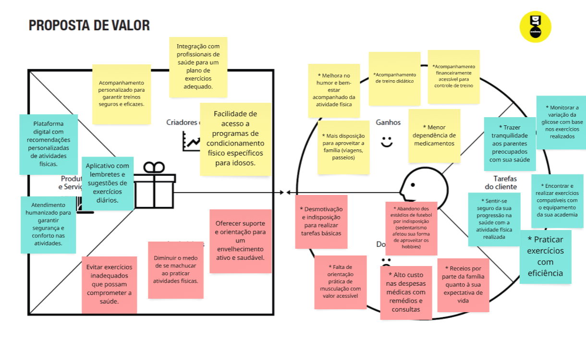

##### Proposta para Julia Barbosa

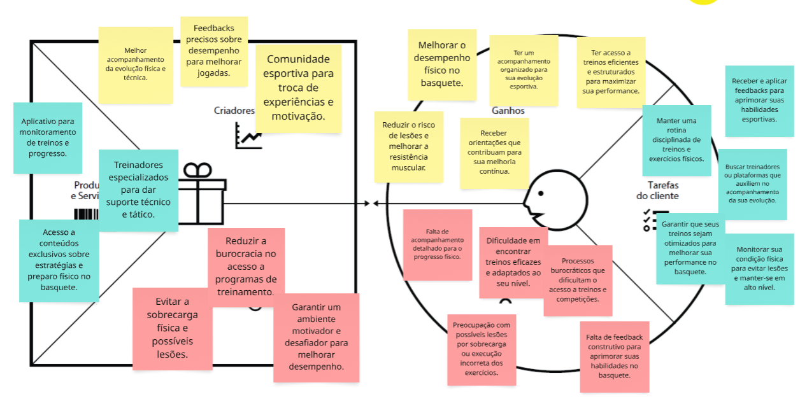

##### Proposta para Julia Barbosa

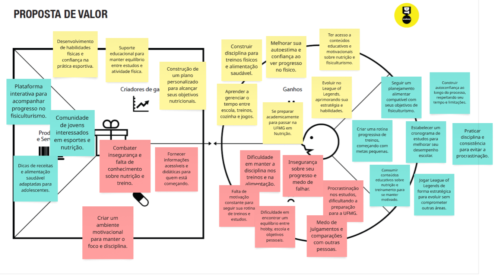

## Requisitos

As tabelas que se seguem apresentam os requisitos funcionais e não funcionais que detalham o escopo do projeto.

### Requisitos Funcionais

| ID     | Descrição do Requisito                                                                   | Prioridade |
| ------ | ---------------------------------------------------------------------------------------- | ---------- |
| RF-001 | Permitir que o aluno registre seus treinos realizados diariamente                        | ALTA       |
| RF-002 | Permitir que o aluno visualize sua evolução ao longo do tempo em gráficos ou relatórios  | ALTA       |
| RF-003 | Permitir que o aluno crie, edite e compartilhe planos de treino                          | MÉDIA      |
| RF-004 | Emitir alertas ou lembretes para incentivar a regularidade dos treinos                   | MÉDIA      |
| RF-005 | Permitir ao aluno registrar dificuldades ou feedbacks após o treino                      | BAIXA      |
| RF-006 | Adaptar os treinos de acordo com o nível do aluno (iniciante, intermediário ou avançado) | ALTA       |
| RF-007 | Disponibilizar um histórico de treinos anteriores                                        | MÉDIA      |
| RF-008 | Permitir o registro de motivação do aluno em cada treino (emojis, notas, etc.)           | BAIXA      |
| RF-009 | Sugerir ajustes no planejamento caso o aluno esteja com baixa regularidade               | MÉDIA      |
| RF-010 | Permitir que o aluno visualize sua rotina semanal de treinos em uma agenda               | ALTA       |

### Requisitos não Funcionais

| ID      | Descrição do Requisito                                                                                                      | Prioridade |
| ------- | --------------------------------------------------------------------------------------------------------------------------- | ---------- |
| RNF-001 | O sistema deverá estar disponível 24 horas por dia, 7 dias por semana.                                                      | ALTA       |
| RNF-002 | O sistema deverá ser responsivo e funcionar adequadamente em dispositivos móveis e desktops.                                | ALTA       |
| RNF-003 | O tempo de carregamento das páginas não deve ultrapassar 3 segundos.                                                        | MÉDIA      |
| RNF-004 | O sistema deverá garantir a segurança dos dados dos alunos, com autenticação e criptografia.                                | ALTA       |
| RNF-005 | O sistema deverá armazenar os dados dos treinos no local storage dentro de um JSON.                                         | ALTA       |
| RNF-006 | O sistema deverá possuir uma interface amigável e intuitiva para facilitar o uso por pessoas com pouca experiência digital. | ALTA       |
| RNF-007 | O sistema deverá suportar um grande número de usuários simultâneos sem perda de desempenho.                                 | MÉDIA      |
| RNF-008 | O sistema deverá utilizar puramente HTML, CSS e JavaScript no front-end.                                                    | ALTA       |
| RNF-009 | O sistema deverá estar hospedado em um ambiente online de acesso público (ex: Vercel, Netlify, Heroku).                     | MÉDIA      |
| RNF-010 | O sistema deverá permitir fácil manutenção e atualização do conteúdo e funcionalidades.                                     | ALTA       |

## Projeto de Interface

Artefatos relacionados com a interface e a interacão do usuário na proposta de solução.

### Wireframes

Estes são os protótipos de telas do sistema.

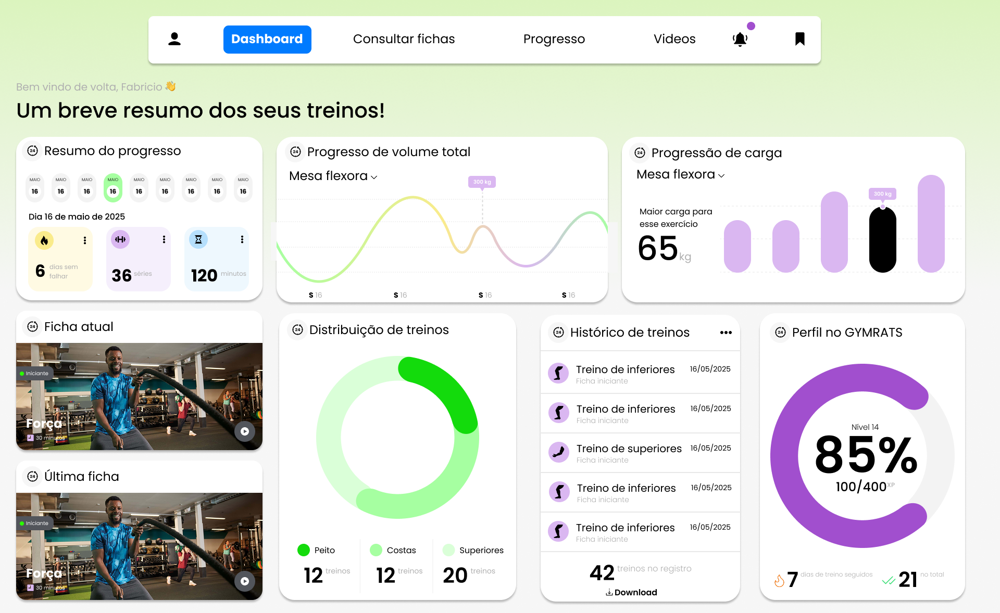

- [Link Wireframe](https://www.figma.com/design/MxEzjBIxjmgspufuSCCXfi/Untitled?node-id=0-1&p=f)

### User Flow

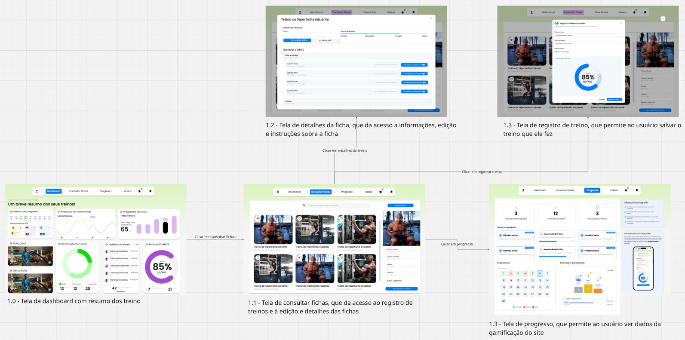

### Protótipo Interativo

[Protótipo Interativo (MarvelApp)](https://marvelapp.com/prototype/803g512/screen/97004127)

# Metodologia

Detalhes sobre a organização do grupo e o ferramental empregado.

## Ferramentas

Relação de ferramentas empregadas pelo grupo durante o projeto.

| Ambiente                      | Plataforma            | Link de acesso                                                                                      |
| ----------------------------- | --------------------- | --------------------------------------------------------------------------------------------------- |
| Processo de Design Thinking   | Miro                  | https://miro.com/app/board/uXjVIReugUE=/                                                            |
| Repositório de código         | GitHub                | https://github.com/ICEI-PUC-Minas-PPLES-TI/plf-es-2025-1-ti1-0387100-controle-de-treino-de-academia |
| Ferramenta de Desenvolvimento | Visual Studio Code    | -                                                                                                   |
| Hospedagem do site            | (Preenchido ao final) | (Preenchido ao final)                                                                               |
| Protótipo Interativo          | MarvelApp             | https://marvelapp.com/prototype/803g512/screen/97004127                                             |
| Ferramenta de Comunicação     | WhatsApp - Discord    | -                                                                                                   |
| Ferramenta Scrum              | Trello                | -                                                                                                   |

## Gerenciamento do Projeto

Divisão de papéis no grupo e apresentação da estrutura da ferramenta de controle de tarefas (Kanban).

Fluxo Scrum com listas:

- BACKLOG – Aqui ficam todas as tarefas planejadas, mas ainda não priorizadas ou selecionadas para o sprint atual.

- TODO – Tarefas priorizadas e definidas para o sprint atual. Estão prontas para serem iniciadas.

- IN PROGRESS – Tarefas que estão em desenvolvimento ativo por um membro da equipe.

- CODE REVIEW – Tarefas com código finalizado aguardando revisão por outros desenvolvedores.

- WAITING TO BE MERGED – Tarefas já revisadas e aprovadas, esperando serem integradas à branch principal.

- CLOSED – Tarefas finalizadas e já incorporadas ao projeto. Representam o trabalho concluído.

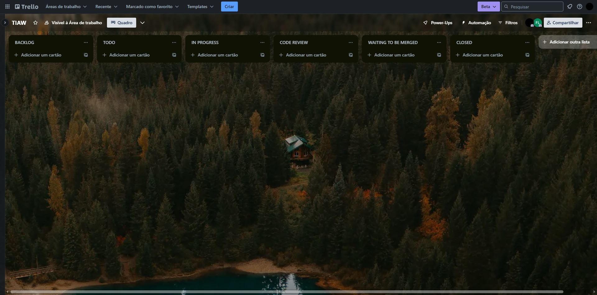

# Solução Implementada

Esta seção apresenta todos os detalhes da solução criada no projeto.

## Vídeo do Projeto

[](https://drive.google.com/file/d/1KCLWKn2vbczQIEAbK9GJr3AkgwAnLBSG/view?usp=sharing)

## Funcionalidades

Esta seção apresenta as funcionalidades da solução.Info

##### Funcionalidade 1 - Cadastro de Contatos ⚠️ EXEMPLO ⚠️

Permite a inclusão, leitura, alteração e exclusão de contatos para o sistema

- **Estrutura de dados:** [Contatos](#ti_ed_contatos)
- **Instruções de acesso:**
  - Abra o site e efetue o login
  - Acesse o menu principal e escolha a opção Cadastros
  - Em seguida, escolha a opção Contatos
- **Tela da funcionalidade**:


> ⚠️ **APAGUE ESSA PARTE ANTES DE ENTREGAR SEU TRABALHO**
>
> Apresente cada uma das funcionalidades que a aplicação fornece tanto para os usuários quanto aos administradores da solução.
>
> Inclua, para cada funcionalidade, itens como: (1) titulos e descrição da funcionalidade; (2) Estrutura de dados associada; (3) o detalhe sobre as instruções de acesso e uso.

## Estruturas de Dados

Descrição das estruturas de dados utilizadas na solução com exemplos no formato JSON.Info

##### Estrutura de Dados - Contatos ⚠️ EXEMPLO ⚠️

Contatos da aplicação

```json
{
  "id": 1,
  "nome": "Leanne Graham",
  "cidade": "Belo Horizonte",
  "categoria": "amigos",
  "email": "Sincere@april.biz",
  "telefone": "1-770-736-8031",
  "website": "hildegard.org"
}
```

##### Estrutura de Dados - Usuários ⚠️ EXEMPLO ⚠️

Registro dos usuários do sistema utilizados para login e para o perfil do sistema

```json
{
  "id": "eed55b91-45be-4f2c-81bc-7686135503f9",
  "email": "admin@abc.com",
  "id": "eed55b91-45be-4f2c-81bc-7686135503f9",
  "login": "admin",
  "nome": "Administrador do Sistema",
  "senha": "123"
}
```

> ⚠️ **APAGUE ESSA PARTE ANTES DE ENTREGAR SEU TRABALHO**
>
> Apresente as estruturas de dados utilizadas na solução tanto para dados utilizados na essência da aplicação quanto outras estruturas que foram criadas para algum tipo de configuração
>
> Nomeie a estrutura, coloque uma descrição sucinta e apresente um exemplo em formato JSON.
>
> **Orientações:**
>
> - [JSON Introduction](https://www.w3schools.com/js/js_json_intro.asp)
> - [Trabalhando com JSON - Aprendendo desenvolvimento web | MDN](https://developer.mozilla.org/pt-BR/docs/Learn/JavaScript/Objects/JSON)

## Módulos e APIs

Esta seção apresenta os módulos e APIs utilizados na solução

**Images**:

- Unsplash - [https://unsplash.com/](https://unsplash.com/) ⚠️ EXEMPLO ⚠️

**Fonts:**

- Icons Font Face - [https://fontawesome.com/](https://fontawesome.com/) ⚠️ EXEMPLO ⚠️

**Scripts:**

- jQuery - [http://www.jquery.com/](http://www.jquery.com/) ⚠️ EXEMPLO ⚠️
- Bootstrap 4 - [http://getbootstrap.com/](http://getbootstrap.com/) ⚠️ EXEMPLO ⚠️

> ⚠️ **APAGUE ESSA PARTE ANTES DE ENTREGAR SEU TRABALHO**
>
> Apresente os módulos e APIs utilizados no desenvolvimento da solução. Inclua itens como: (1) Frameworks, bibliotecas, módulos, etc. utilizados no desenvolvimento da solução; (2) APIs utilizadas para acesso a dados, serviços, etc.

# Referências

As referências utilizadas no trabalho foram:

ORGANIZAÇÃO DAS NAÇÕES UNIDAS. Objetivos de Desenvolvimento Sustentável (ODS). Disponível em: https://brasil.un.org/pt-br/sdgs. Acesso em: 06 abr. 2025.

MINISTÉRIO DA SAÚDE (BRASIL). Guia de Atividade Física para a População Brasileira. Brasília: Ministério da Saúde, 2011.
