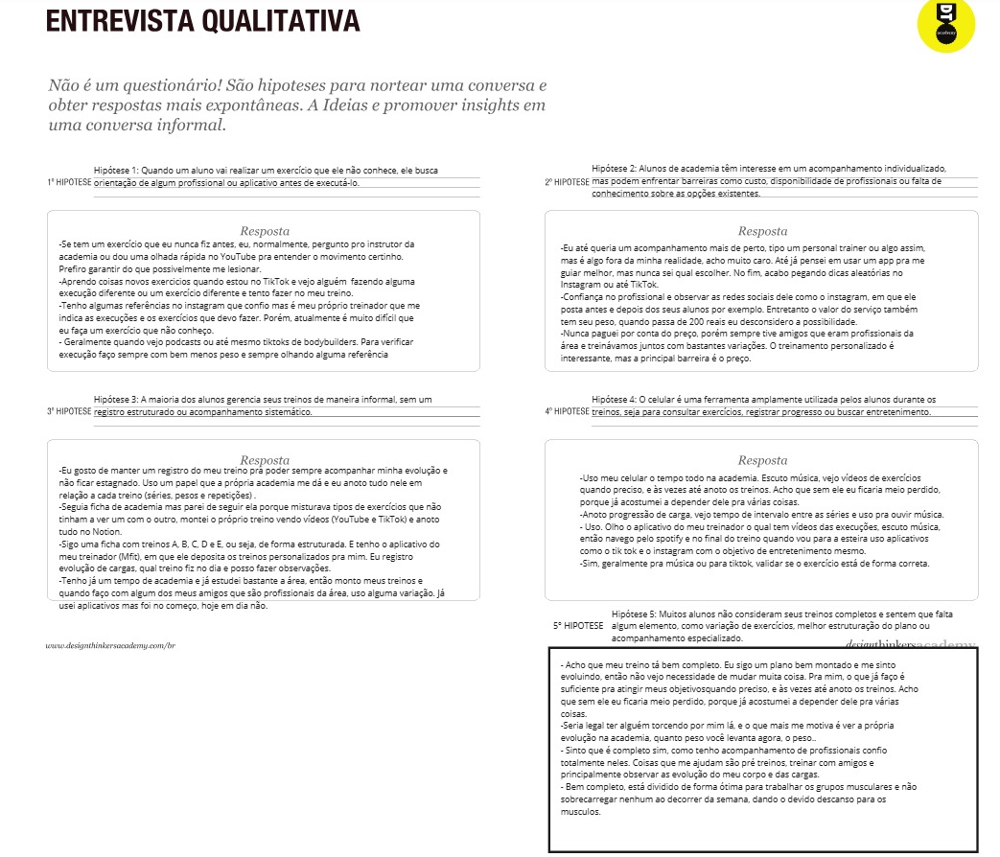

# Introdução

Informações básicas do projeto.

- **Projeto:** [NOME DO PROJETO]
- **Repositório GitHub:** [LINK PARA O REPOSITÓRIO NO GITHUB]
- **Membros da equipe:**

  - [Fulano](https://github.com/fulano) ⚠️ EXEMPLO ⚠️
  - [Beltrano](https://github.com/beltrano) ⚠️ EXEMPLO ⚠️
  - [Cicrano](https://github.com/cicrano) ⚠️ EXEMPLO ⚠️

A documentação do projeto é estruturada da seguinte forma:

1. Introdução
2. Contexto
3. Product Discovery
4. Product Design
5. Metodologia
6. Solução
7. Referências Bibliográficas

✅ [Documentação de Design Thinking (MIRO)](files/processo-dt.pdf)

# Contexto

A manutenção de uma rotina regular de exercícios físicos é fundamental para a promoção da saúde e da qualidade de vida. As academias, como ambientes estruturados para a prática de atividades físicas, desempenham um papel central nesse processo. No entanto, muitos praticantes encontram dificuldades em manter a consistência nos treinos, acompanhar seu desempenho ao longo do tempo e organizar adequadamente suas atividades. Soma-se a isso a carência de soluções digitais acessíveis e eficazes que auxiliem no registro, planejamento e visualização do progresso de forma personalizada.

Diante desse cenário, este projeto propõe o desenvolvimento de uma aplicação web voltada ao gerenciamento de treinos em academias, com foco na experiência do usuário e no suporte à sua evolução. A aplicação oferece funcionalidades que permitem ao aluno registrar suas atividades diárias, acompanhar métricas de desempenho, gerar relatórios e gráficos, receber lembretes e sugestões automáticas, além de personalizar planos de treino de acordo com seu nível (iniciante, intermediário ou avançado) e histórico de participação.

A iniciativa também leva em consideração as restrições técnicas impostas pelo escopo acadêmico: a aplicação será implementada exclusivamente com HTML, CSS e JavaScript puro. Não será utilizado backend ou banco de dados, sendo o armazenamento realizado localmente através do localStorage, em estrutura JSON.

Essa abordagem visa consolidar conhecimentos fundamentais de desenvolvimento web, usabilidade, design responsivo, armazenamento local e boas práticas de segurança e desempenho. O público-alvo do sistema são alunos de academias que desejam uma ferramenta prática, responsiva e intuitiva para acompanhar e gerenciar sua rotina de treinos, com foco principal em acessos via dispositivos móveis, considerando o comportamento predominante dos usuários.

## Problema

A adesão e a manutenção de uma rotina consistente de treinos físicos é um desafio enfrentado por grande parte dos frequentadores de academias. Muitos alunos têm dificuldades em organizar seus treinos, acompanhar sua evolução ao longo do tempo e manter a motivação necessária para atingir seus objetivos. Em especial, a ausência de ferramentas simples e acessíveis para registrar informações e monitorar o progresso acaba dificultando a visualização dos resultados, o que pode levar à desmotivação e até ao abandono da prática.

Esse problema se agrava pelo fato de que nem todos os alunos possuem acompanhamento individualizado de profissionais, tornando ainda mais importante o uso de soluções que apoiem a autogestão da rotina de treinos. O contexto de uso da aplicação está centrado no ambiente de academias, sendo voltada principalmente a alunos que desejam ter maior controle sobre seus treinos de forma independente.

## Objetivos

O objetivo geral deste projeto é desenvolver uma aplicação web que auxilie alunos de academias a organizarem, registrarem e acompanharem sua rotina de treinos de forma prática e personalizada, contribuindo para a manutenção da regularidade e o acompanhamento da evolução física ao longo do tempo.

Objetivos específicos

- Implementar funcionalidades que permitam o registro diário de treinos, com dados como tipo de exercício, carga, repetições e observações adicionais.

- Criar mecanismos de visualização da evolução do usuário, como gráficos e relatórios simples, com base nas informações registradas.

- Desenvolver uma interface responsiva e intuitiva, com foco na usabilidade em dispositivos móveis.

- Utilizar armazenamento local via localStorage para salvar os dados do usuário, respeitando as restrições técnicas do projeto.

- Explorar recursos interativos, como lembretes de treino e feedback pós-treino, para incentivar a constância e engajamento do usuário.

## Justificativa

O que impulsionou a realização deste trabalho foi compreender que a manutenção de uma rotina de treinos é um desafio comum enfrentado por alunos de academias, muitas vezes pela ausência de organização, registro de atividades e acompanhamento de resultados. A motivação central está na percepção de que, ao tornar esse processo mais acessível e visual, é possível aumentar a constância e o engajamento dos praticantes. Além disso, o desenvolvimento deste projeto representa uma oportunidade de aplicar e aprofundar conhecimentos em desenvolvimento web, usabilidade e design centrado no usuário.

## Público-Alvo

A aplicação é voltada principalmente para alunos de academias que desejam organizar e acompanhar sua rotina de treinos de forma prática e acessível. O público-alvo é composto por pessoas que praticam atividades físicas regularmente ou estão iniciando essa jornada e buscam maior controle sobre sua evolução pessoal, mesmo sem acompanhamento direto de um profissional de educação física.

Perfis de usuários:

- Praticantes iniciantes: indivíduos que estão começando na academia, com pouca experiência no planejamento de treinos. Em geral, possuem conhecimento básico de tecnologia e utilizam o celular como principal meio de acesso à internet.

- Praticantes intermediários ou avançados: usuários com rotina de treino estabelecida, que já têm familiaridade com tipos de exercícios, mas desejam melhorar o acompanhamento da evolução e otimizar sua organização. Esses usuários tendem a buscar funcionalidades mais analíticas, como gráficos e relatórios.

- Usuários de dispositivos digitais (celular ou computador): pessoas que utilizam dispositivos digitais em seu dia a dia para navegar na internet ou acessar ferramentas online, incluindo alunos com diferentes níveis de familiaridade com tecnologia. A interface da aplicação busca atender tanto usuários experientes quanto aqueles com baixa afinidade digital, oferecendo uma navegação simples, clara e intuitiva.

A aplicação foi pensada para ser utilizada prioritariamente em dispositivos móveis, considerando o comportamento de uso típico dos frequentadores de academias — que preferem acessar recursos diretamente pelo celular durante ou após o treino. Por esse motivo, a interface deve ser responsiva, com foco em usabilidade e acessibilidade.

Além disso, como não há hierarquia entre os usuários (a aplicação é voltada ao uso individual), todos os perfis têm acesso às mesmas funcionalidades, com foco na personalização da experiência de acordo com suas necessidades e níveis de prática.

# Product Discovery

## Etapa de Entendimento

- **Matriz CSD**:
  
- **Mapa de stakeholders**:
  
- **Entrevistas qualitativas**:
  
- **Highlights de pesquisa**:
  

## Etapa de Definição

### Personas


# Product Design

Nesse momento, vamos transformar os insights e validações obtidos em soluções tangíveis e utilizáveis. Essa fase envolve a definição de uma proposta de valor, detalhando a prioridade de cada ideia e a consequente criação de wireframes, mockups e protótipos de alta fidelidade, que detalham a interface e a experiência do usuário.

## Histórias de Usuários

Com base na análise das personas foram identificadas as seguintes histórias de usuários:

| EU COMO...`PERSONA` | QUERO/PRECISO ...`FUNCIONALIDADE`      | PARA ...`MOTIVO/VALOR`                 |
| ------------------- | -------------------------------------- | -------------------------------------- |
| Usuário do sistema  | Registrar minhas tarefas ⚠️ EXEMPLO ⚠️ | Não esquecer de fazê-las               |
| Administrador       | Alterar permissões ⚠️ EXEMPLO ⚠️       | Permitir que possam administrar contas |

> ⚠️ **APAGUE ESSA PARTE ANTES DE ENTREGAR SEU TRABALHO**
>
> Apresente aqui as histórias de usuário que são relevantes para o projeto de sua solução. As Histórias de Usuário consistem em uma ferramenta poderosa para a compreensão e elicitação dos requisitos funcionais e não funcionais da sua aplicação. Se possível, agrupe as histórias de usuário por contexto, para facilitar consultas recorrentes à essa parte do documento.
>
> **Orientações**:
>
> - [Histórias de usuários com exemplos e template](https://www.atlassian.com/br/agile/project-management/user-stories)
> - [Como escrever boas histórias de usuário (User Stories)](https://medium.com/vertice/como-escrever-boas-users-stories-hist%C3%B3rias-de-usu%C3%A1rios-b29c75043fac)

## Proposta de Valor

**✳️✳️✳️ APRESENTE O DIAGRAMA DA PROPOSTA DE VALOR PARA CADA PERSONA ✳️✳️✳️**

##### Proposta para Persona XPTO ⚠️ EXEMPLO ⚠️


> ⚠️ **APAGUE ESSA PARTE ANTES DE ENTREGAR SEU TRABALHO**
>
> O mapa da proposta de valor é uma ferramenta que nos ajuda a definir qual tipo de produto ou serviço melhor atende às personas definidas anteriormente.

## Requisitos

As tabelas que se seguem apresentam os requisitos funcionais e não funcionais que detalham o escopo do projeto.

### Requisitos Funcionais

| ID     | Descrição do Requisito                                | Prioridade |
| ------ | ----------------------------------------------------- | ---------- |
| RF-001 | Permitir que o usuário cadastre tarefas ⚠️ EXEMPLO ⚠️ | ALTA       |
| RF-002 | Emitir um relatório de tarefas no mês ⚠️ EXEMPLO ⚠️   | MÉDIA      |

### Requisitos não Funcionais

| ID      | Descrição do Requisito                                                          | Prioridade |
| ------- | ------------------------------------------------------------------------------- | ---------- |
| RNF-001 | O sistema deve ser responsivo para rodar em um dispositivos móvel ⚠️ EXEMPLO ⚠️ | MÉDIA      |
| RNF-002 | Deve processar requisições do usuário em no máximo 3s ⚠️ EXEMPLO ⚠️             | BAIXA      |

> ⚠️ **APAGUE ESSA PARTE ANTES DE ENTREGAR SEU TRABALHO**
>
> Os requisitos de um projeto são classificados em dois grupos:
>
> - [Requisitos Funcionais (RF)](https://pt.wikipedia.org/wiki/Requisito_funcional):
>   correspondem a uma funcionalidade que deve estar presente na plataforma (ex: cadastro de usuário).
> - [Requisitos Não Funcionais (RNF)](https://pt.wikipedia.org/wiki/Requisito_n%C3%A3o_funcional):
>   correspondem a uma característica técnica, seja de usabilidade, desempenho, confiabilidade, segurança ou outro (ex: suporte a dispositivos iOS e Android).
>
> Lembre-se que cada requisito deve corresponder à uma e somente uma característica alvo da sua solução. Além disso, certifique-se de que todos os aspectos capturados nas Histórias de Usuário foram cobertos.
>
> **Orientações**:
>
> - [O que são Requisitos Funcionais e Requisitos Não Funcionais?](https://codificar.com.br/requisitos-funcionais-nao-funcionais/)
> - [O que são requisitos funcionais e requisitos não funcionais?](https://analisederequisitos.com.br/requisitos-funcionais-e-requisitos-nao-funcionais-o-que-sao/)

## Projeto de Interface

Artefatos relacionados com a interface e a interacão do usuário na proposta de solução.

### Wireframes

Estes são os protótipos de telas do sistema.

**✳️✳️✳️ COLOQUE AQUI OS PROTÓTIPOS DE TELAS COM TÍTULO E DESCRIÇÃO ✳️✳️✳️**

##### TELA XPTO ⚠️ EXEMPLO ⚠️

Descrição para a tela XPTO


> ⚠️ **APAGUE ESSA PARTE ANTES DE ENTREGAR SEU TRABALHO**
>
> Wireframes são protótipos das telas da aplicação usados em design de interface para sugerir a estrutura de um site web e seu relacionamentos entre suas páginas. Um wireframe web é uma ilustração semelhante ao layout de elementos fundamentais na interface.
>
> **Orientações**:
>
> - [Ferramentas de Wireframes](https://rockcontent.com/blog/wireframes/)
> - [Figma](https://www.figma.com/)
> - [Adobe XD](https://www.adobe.com/br/products/xd.html#scroll)
> - [MarvelApp](https://marvelapp.com/developers/documentation/tutorials/)

### User Flow

**✳️✳️✳️ COLOQUE AQUI O DIAGRAMA DE FLUXO DE TELAS ✳️✳️✳️**


> ⚠️ **APAGUE ESSA PARTE ANTES DE ENTREGAR SEU TRABALHO**
>
> Fluxo de usuário (User Flow) é uma técnica que permite ao desenvolvedor mapear todo fluxo de telas do site ou app. Essa técnica funciona para alinhar os caminhos e as possíveis ações que o usuário pode fazer junto com os membros de sua equipe.
>
> **Orientações**:
>
> - [User Flow: O Quê É e Como Fazer?](https://medium.com/7bits/fluxo-de-usu%C3%A1rio-user-flow-o-que-%C3%A9-como-fazer-79d965872534)
> - [User Flow vs Site Maps](http://designr.com.br/sitemap-e-user-flow-quais-as-diferencas-e-quando-usar-cada-um/)
> - [Top 25 User Flow Tools &amp; Templates for Smooth](https://www.mockplus.com/blog/post/user-flow-tools)

### Protótipo Interativo

**✳️✳️✳️ COLOQUE AQUI UM IFRAME COM SEU PROTÓTIPO INTERATIVO ✳️✳️✳️**

✅ [Protótipo Interativo (MarvelApp)](https://marvelapp.com/prototype/4hd6091?emb=1&iosapp=false&frameless=false) ⚠️ EXEMPLO ⚠️

> ⚠️ **APAGUE ESSA PARTE ANTES DE ENTREGAR SEU TRABALHO**
>
> Um protótipo interativo apresenta o projeto de interfaces e permite ao usuário navegar pelas funcionalidades como se estivesse lidando com o software pronto. Utilize as mesmas ferramentas de construção de wireframes para montagem do seu protótipo interativo. Inclua o link para o protótipo interativo do projeto.

# Metodologia

Detalhes sobre a organização do grupo e o ferramental empregado.

## Ferramentas

Relação de ferramentas empregadas pelo grupo durante o projeto.

| Ambiente                    | Plataforma | Link de acesso                                |
| --------------------------- | ---------- | --------------------------------------------- |
| Processo de Design Thinking | Miro       | https://miro.com/XXXXXXX ⚠️ EXEMPLO ⚠️        |
| Repositório de código       | GitHub     | https://github.com/XXXXXXX ⚠️ EXEMPLO ⚠️      |
| Hospedagem do site          | Render     | https://site.render.com/XXXXXXX ⚠️ EXEMPLO ⚠️ |
| Protótipo Interativo        | MarvelApp  | https://marvelapp.com/XXXXXXX ⚠️ EXEMPLO ⚠️   |
|                             |            |                                               |

> ⚠️ **APAGUE ESSA PARTE ANTES DE ENTREGAR SEU TRABALHO**
>
> Liste as ferramentas empregadas no desenvolvimento do projeto, justificando a escolha delas, sempre que possível. Inclua itens como: (1) Editor de código, (2) )ferramentas de comunicação, (3) )ferramentas de diagramação, (4) )plataformas de hospedagem, entre outras.

## Gerenciamento do Projeto

Divisão de papéis no grupo e apresentação da estrutura da ferramenta de controle de tarefas (Kanban).


> ⚠️ **APAGUE ESSA PARTE ANTES DE ENTREGAR SEU TRABALHO**
>
> Nesta parte do documento, você deve apresentar o processo de trabalho baseado nas metodologias ágeis, a divisão de papéis e tarefas, as ferramentas empregadas e como foi realizada a gestão de configuração do projeto via GitHub.
>
> Coloque detalhes sobre o processo de Design Thinking e a implementação do Framework Scrum seguido pelo grupo. O grupo poderá fazer uso de ferramentas on-line para acompanhar o andamento do projeto, a execução das tarefas e o status de desenvolvimento da solução.
>
> **Orientações**:
>
> - [Sobre Projects - GitHub Docs](https://docs.github.com/pt/issues/planning-and-tracking-with-projects/learning-about-projects/about-projects)
> - [Gestão de projetos com GitHub | balta.io](https://balta.io/blog/gestao-de-projetos-com-github)
> - [(460) GitHub Projects - YouTube](https://www.youtube.com/playlist?list=PLiO7XHcmTsldZR93nkTFmmWbCEVF_8F5H)
> - [11 Passos Essenciais para Implantar Scrum no seu Projeto](https://mindmaster.com.br/scrum-11-passos/)
> - [Scrum em 9 minutos](https://www.youtube.com/watch?v=XfvQWnRgxG0)

# Solução Implementada

Esta seção apresenta todos os detalhes da solução criada no projeto.

## Vídeo do Projeto

O vídeo a seguir traz uma apresentação do problema que a equipe está tratando e a proposta de solução. ⚠️ EXEMPLO ⚠️

[](https://www.youtube.com/embed/70gGoFyGeqQ)

> ⚠️ **APAGUE ESSA PARTE ANTES DE ENTREGAR SEU TRABALHO**
>
> O video de apresentação é voltado para que o público externo possa conhecer a solução. O formato é livre, sendo importante que seja apresentado o problema e a solução numa linguagem descomplicada e direta.
>
> Inclua um link para o vídeo do projeto.

## Funcionalidades

Esta seção apresenta as funcionalidades da solução.Info

##### Funcionalidade 1 - Cadastro de Contatos ⚠️ EXEMPLO ⚠️

Permite a inclusão, leitura, alteração e exclusão de contatos para o sistema

- **Estrutura de dados:** [Contatos](#ti_ed_contatos)
- **Instruções de acesso:**
  - Abra o site e efetue o login
  - Acesse o menu principal e escolha a opção Cadastros
  - Em seguida, escolha a opção Contatos
- **Tela da funcionalidade**:


> ⚠️ **APAGUE ESSA PARTE ANTES DE ENTREGAR SEU TRABALHO**
>
> Apresente cada uma das funcionalidades que a aplicação fornece tanto para os usuários quanto aos administradores da solução.
>
> Inclua, para cada funcionalidade, itens como: (1) titulos e descrição da funcionalidade; (2) Estrutura de dados associada; (3) o detalhe sobre as instruções de acesso e uso.

## Estruturas de Dados

Descrição das estruturas de dados utilizadas na solução com exemplos no formato JSON.Info

##### Estrutura de Dados - Contatos ⚠️ EXEMPLO ⚠️

Contatos da aplicação

```json
{
  "id": 1,
  "nome": "Leanne Graham",
  "cidade": "Belo Horizonte",
  "categoria": "amigos",
  "email": "Sincere@april.biz",
  "telefone": "1-770-736-8031",
  "website": "hildegard.org"
}
```

##### Estrutura de Dados - Usuários ⚠️ EXEMPLO ⚠️

Registro dos usuários do sistema utilizados para login e para o perfil do sistema

```json
{
  "id": "eed55b91-45be-4f2c-81bc-7686135503f9",
  "email": "admin@abc.com",
  "id": "eed55b91-45be-4f2c-81bc-7686135503f9",
  "login": "admin",
  "nome": "Administrador do Sistema",
  "senha": "123"
}
```

> ⚠️ **APAGUE ESSA PARTE ANTES DE ENTREGAR SEU TRABALHO**
>
> Apresente as estruturas de dados utilizadas na solução tanto para dados utilizados na essência da aplicação quanto outras estruturas que foram criadas para algum tipo de configuração
>
> Nomeie a estrutura, coloque uma descrição sucinta e apresente um exemplo em formato JSON.
>
> **Orientações:**
>
> - [JSON Introduction](https://www.w3schools.com/js/js_json_intro.asp)
> - [Trabalhando com JSON - Aprendendo desenvolvimento web | MDN](https://developer.mozilla.org/pt-BR/docs/Learn/JavaScript/Objects/JSON)

## Módulos e APIs

Esta seção apresenta os módulos e APIs utilizados na solução

**Images**:

- Unsplash - [https://unsplash.com/](https://unsplash.com/) ⚠️ EXEMPLO ⚠️

**Fonts:**

- Icons Font Face - [https://fontawesome.com/](https://fontawesome.com/) ⚠️ EXEMPLO ⚠️

**Scripts:**

- jQuery - [http://www.jquery.com/](http://www.jquery.com/) ⚠️ EXEMPLO ⚠️
- Bootstrap 4 - [http://getbootstrap.com/](http://getbootstrap.com/) ⚠️ EXEMPLO ⚠️

> ⚠️ **APAGUE ESSA PARTE ANTES DE ENTREGAR SEU TRABALHO**
>
> Apresente os módulos e APIs utilizados no desenvolvimento da solução. Inclua itens como: (1) Frameworks, bibliotecas, módulos, etc. utilizados no desenvolvimento da solução; (2) APIs utilizadas para acesso a dados, serviços, etc.

# Referências

As referências utilizadas no trabalho foram:

- SOBRENOME, Nome do autor. Título da obra. 8. ed. Cidade: Editora, 2000. 287 p ⚠️ EXEMPLO ⚠️

> ⚠️ **APAGUE ESSA PARTE ANTES DE ENTREGAR SEU TRABALHO**
>
> Inclua todas as referências (livros, artigos, sites, etc) utilizados no desenvolvimento do trabalho.
>
> **Orientações**:
>
> - [Formato ABNT](https://www.normastecnicas.com/abnt/trabalhos-academicos/referencias/)
> - [Referências Bibliográficas da ABNT](https://comunidade.rockcontent.com/referencia-bibliografica-abnt/)
